# Development Workflow

This documents the automated development workflow using the `/implement` skill from Claude Code, Codex, or Cursor CLI. The workflow takes a Ground Control requirement from plan through PR-ready with a single skill invocation.

> **File-based requirement flow (issues #1500, #1541).** Ground Control is now the MCP server over repo-local files. The `/implement` requirement edits are made in the delivery diff, **before publish**: Step 15 sets `status: ACTIVE` in the `docs/requirements/<UID>/requirement.md` frontmatter, and Step 16 records IMPLEMENTS / TESTS entries in its `## Traceability` section - both reviewed in and merged by the delivery PR. Phase E then makes no requirement-file edits; it verifies the merged files at the immutable merge revision before the final report and close. There is no backend, database, or graph.

## Prerequisites

Ground Control is the MCP server for the `/implement` workflow over repo-local
files (issue #1500). A working host needs the following.

| Requirement | Why |
|---|---|
| Node.js 20+ | Runs the MCP server (`make ground-control-mcp-install` installs its dependencies) |
| `git` and an authenticated `gh` | The server owns every privileged Git and GitHub side effect (ADR-027) |
| Python 3 | Runs the repo-native policy tooling (`make policy`) |
| Codex CLI on `PATH` | Backs the architecture preflight and the pre-push review tools |
| A `claude` CLI and a review-engine auth mode declared in `.env` | Backs the Step 6.6 test-quality review (see **Test-quality review engine**) |
| Commit signing configured | Commits are signed non-interactively; the workflow never prompts |

Optional environment variables are listed in
[`mcp/ground-control/README.md`](../mcp/ground-control/README.md) and templated in
`.env.example`. None is required: the server starts and every registered tool
that needs no variable works with none of them set.

**Provisioning the MCP host (issue #1562).** `<launch directory>/.env` is the
only source of Ground Control's variables, whether the server was started by
Claude Code, Codex, or anything else. No machine-level or user-level file is
consulted, and no variable falls back to the ambient environment the launcher
passed down. If a variable a tool needs is absent, that tool does not run: it
returns an error naming the variable and the file, and the operator fixes the
`.env` and restarts the server, which is when the file is read.

The launch directory is a deliberate control. It is what lets separate checkouts
draw on resources belonging to different projects or organizations, and what
makes it possible to deploy Ground Control into a single-repo sandbox. Issue #946
had reached the opposite arrangement - inherited value first, then `.env`, then a
per-host `~/.config/ground-control/env` - which made a tool's correctness a
property of whichever runtime happened to host it and silently substituted a
global credential into a repository that deliberately has none. #1562 removed
the machine-level file and the ambient fallback together.

The rule governs Ground Control's own variables, listed in
`mcp/ground-control/lib/server-env.js`. It does not hand a spawned `claude` or
`codex` an empty environment: those children still receive `PATH`, `HOME`, and
the rest of the OS state they need to execute.

## Workflow: `/implement <issue-number | requirement-uid>`

Every `/implement` run is driven by a GitHub issue. The issue is the durable artifact that records why the change is being made, which requirements are in scope (if any), and what acceptance looks like. You invoke the skill in either of two ways:

- **`/implement 123`** or **`/implement #123`**: implement GitHub issue #123 in the current repo. The issue body may declare in-scope requirements under a `## Requirements` section (a bulleted list of UIDs). The skill parses that section and carries the list through clause verification, traceability reconciliation, and status transitions. If the section is absent or empty, the run is treated as a bug fix / refactor / maintenance change with no formal requirements; traceability is still reconciled against the diff, but no requirement is transitioned to `ACTIVE`.
- **`/implement GC-X042`**: implement a requirement by UID. The skill finds the open GitHub issue linked to that requirement via traceability (`artifact_type: GITHUB_ISSUE`); if no such issue exists, it creates one via `gc_create_github_issue` and adds the UID to its `## Requirements` section. From that point forward the run is identical to the first form: the issue becomes the authoritative input.

Grouped implementation (shipping several related requirements in one PR) is expressed by listing all of them under `## Requirements` in a single issue body. One issue → one `/implement` run → one PR → N requirements transitioned to `ACTIVE` in the same commit stream. Do NOT spin up one issue per requirement when they belong together; the grouping is what makes the review boundary coherent.

Repo-local Ground Control project context comes from a `.ground-control.yaml` file at the repo root (with larger rule files under `.gc/`), not from `AGENTS.md` inline YAML or hardcoded assumptions in the skill. The workflow validates this via `gc_get_repo_ground_control_context` before it starts implementation; that call returns the project id, workflow commands, SonarCloud settings, and plan rules in a single response. It should:
- use the repo's configured Ground Control `project` when present
- treat inputs like `OBS-001`, `DSL-101`, `API-412`, or `GC-J001` as already-complete UIDs
- avoid guessing a prefix from the repository name

The parser lives in `mcp/ground-control/lib/ground-control-config.js` and is published through the
`mcp/ground-control/lib.js` barrel. The documentation-coverage gate treats both as the
`config_parser` surface, so a change to either requires a documentation outcome (ADR-054). Keep the
parser in that module: the gate anchors on literal paths, and `run_doc_coverage_anchor_contract`
(`make policy`) fails when an anchor stops naming a real file rather than letting the surface match
nothing and quietly stop asking.

Recommended `.ground-control.yaml` convention:

```yaml
schema_version: 1
project: aces-sdl
github_repo: owner/repo

workflow:
  test_command: make test
  completion_command: make check
  lint_command: make lint
  format_command: make format
  # Repo-native policy/governance gate. Defaults to `make policy`; set it when
  # your gate is named differently. It is never skipped when absent.
  policy_command: make policy
  # Pre-publish hook boundary. Defaults to `pre-commit run --all-files`; set it
  # for lefthook, husky, or a bespoke script.
  precommit_command: pre-commit run --all-files
  base_branch: dev

sonarcloud:
  project_key: Owner_Project
  organization: owner

rules:
  plan_rules: .gc/plan-rules.md

knowledge:
  dir: docs/knowledge
  schema: docs/knowledge/SCHEMA.md
  inbox: docs/knowledge/inbox

docs:
  adr_dir: architecture/adrs/
  architecture_overview: docs/architecture/ARCHITECTURE.md
  coding_standards: docs/CODING_STANDARDS.md
  workflow_reference: docs/DEVELOPMENT_WORKFLOW.md
  knowledge_base: docs/knowledge/

example_paths:
  source: src/
  test: tests/

requirements:
  uid_examples:
    - GC-X001
    - OBS-042

cross_cutting_concerns:
  description: |
    Logger: <project logging convention>
    Validation: <schema / validation convention>
    Errors: <error envelope / handler>
    Tests: <fixture and test-slice patterns>

routing:
  enabled: false
  default_provider: claude
  stages:
    implementation:
      tier: medium
      provider: claude
      model: claude-sonnet-5

```

Config contract:

- `schema_version` is required and currently must be `1`.
- `project` is required and must be a lowercase identifier using letters, numbers, and hyphens.
- Unknown top-level keys are rejected. Current top-level keys are `schema_version`, `project`, `github_repo`, `workflow`, `sonarcloud`, `rules`, `knowledge`, `docs`, `example_paths`, `requirements`, `cross_cutting_concerns`, `routing`, `architecture`, and `short_code`. Legacy `grc` and `telemetry` keys are tolerated so existing consumer configs do not break, but both are ignored inputs rather than supported configuration surfaces (ADR-089, issue #1303).
- `workflow.*` values are optional non-empty strings. `workflow.base_branch` must be a safe Git ref name using `[A-Za-z0-9._/-]`.
- `sonarcloud` is optional, but when present it must include non-empty `project_key` and `organization`. `sonarcloud.quality_gate` and `sonarcloud.analysis_check` are optional non-empty strings. `analysis_check` names the CI check-run or workflow that publishes this repo's Sonar analysis, so the watcher can tell "the analysis has not landed yet" from "no analysis is coming" (issue #1559); absent, any check whose name or workflow name matches `/sonar/i` is treated as the producer. It selects an existing producer - it never asserts that a scan may be skipped.
- `rules.plan_rules` is optional and points to the repo-relative plan-rules file whose content is inlined into `gc_get_repo_ground_control_context`.
- `knowledge.dir` is required when `knowledge` is present. `knowledge.schema` and `knowledge.inbox` are optional overrides; by default they resolve under `knowledge.dir`.
- `docs.*` and `example_paths.*` are optional repo-relative paths. Docs paths are containment-checked so a config file cannot point an agent outside the repository.
- `requirements.uid_examples` is optional and must be a list of non-empty strings.
- **UID allocation is manual (ADR-093).** Requirements are repo-local files, so a new one is a new `docs/requirements/<UID>/requirement.md` directory whose frontmatter `id` matches the directory name. Pick the next free `{PREFIX}-{N}` for the prefix you are extending. The server-side allocator described by ADR-060 went with the database it read its high-water mark from.
- **Requirement UID validation is a bounded-scalar check, not a grammar (issue #1425).** A UID is project-local identity within a 50-character bound, and `{PREFIX}-{N}` carries no zero-padding, so `APP-2` is as canonical as `GC-O007`. MCP tools that accept a UID therefore validate a single, non-empty, transport-safe identifier within that bound and leave existence to the file lookup in `mcp/ground-control/lib/requirement-files.js`; an unknown UID comes back through the normal error envelope rather than being refused as malformed input. Do not derive UID validation from a prefix grammar: prefix choice and identity lookup are different concepts. Three concepts stay separate: structured input validation (bounded scalar), identity resolution (a file read at the exact UID path), and rendered-body recognition (a presentation-policy check over Markdown). Every surface accepts a subset of that one corpus, and the surfaces that gate publishing accept exactly it: `gc_render_pr_body` and the `pr-requirement-uid` gate in `tools/policy/checks.py` both take the full corpus, so a UID that reconciles and reports can always be rendered. The PR-body gate reaches that parity by parsing the `## Requirement UIDs` section structurally (one UID per bullet, or the explicit `- (none ...)` marker for requirement-free runs) rather than scanning the whole body for a UID-shaped token. Scoping to the section is also what stops an `ADR-NNN` reference elsewhere from satisfying a requirement gate. Only free-form prose scanning keeps a narrower shape, because `notes` and `prose` are themselves valid identifiers and no lookup is available to settle it there; that path never gates rendering or reporting.
- `cross_cutting_concerns.description` is optional free text shown to agents during planning.
- `routing.enabled` defaults to `false`. When enabled, omitted `/implement` stages use built-in defaults; `routing.stages.<stage>` overrides a specific stage/purpose route.
- Routing stages use lowercase stage keys matching `[a-z][a-z0-9_-]*`. Route fields are `tier`, `provider`, and `model`.
- Routing `tier` is one of `low`, `medium`, or `high`; `provider` currently supports `claude`. Routing is advisory metadata and does not select an executor or force delegation.
- Claude model values in executable routing config must be canonical CLI ids such as `claude-haiku-4-5`, `claude-sonnet-5`, or `claude-opus-4-8`; display aliases like `sonnet-4.6` are rejected.

`AGENTS.md` should still carry a brief `Ground Control Context` section that points agents at `.ground-control.yaml` and `.gc/`, so repo newcomers know where the workflow config lives.

### User Touchpoint

Per ADR-029, the workflow has **one** synchronous human touchpoint: PR review and merge to `dev`. Plans are posted to the GitHub issue thread as comments and the agent proceeds without waiting; review findings and decisions on findings are also recorded on the issue thread. Everything before merge is automated.

### High-level flow

```mermaid
flowchart TB
  Start([/implement #issue or UID])
  S1[1 · Resolve issue · flag in-progress · parse Requirements]
  S2[2 · Read issue body + comments]
  S3[3 · Codex architecture preflight]
  S4[4 · Explore codebase + consult knowledge base]
  S5[5 · Post plan as issue comment]
  S6[6 · TDD implementation]
  S15[15 · Phase B · Transition in-scope requirements DRAFT → ACTIVE · in the delivery diff]
  S16[16 · Phase B · Reconcile traceability against the diff · in the delivery diff]
  S7[7 · pre-commit run]
  S8[8 · Completion gate · configured completion + policy commands]
  S8b[8.5 · Pre-push gc_codex_review · core + security · default cap 1 · posts findings record to issue thread]
  S8c[8.6 · Pre-push gc_test_quality_review · default cap 1 · posts findings record to issue thread]
  S9[9 · Stage + commit + push]
  S10[10 · Create PR to dev · Refs #issue when requirement-backed]
  S11[11 · CI monitor]
  S12[12 · SonarCloud sweep]
  S17r[17 · Pre-merge readiness record · proposed state · DO NOT MERGE]
  End([User reviews PR and merges])
  S17d[17 · Phase E · Verify merged requirement state at merge revision + final report]
  S20[20 · Phase E · Close issue · merge + final-report-marker gate]
  Done([Issue closed · merged state verified])

  Start --> S1
  S1 --> S2
  S2 --> S3
  S3 --> S4
  S4 --> S5
  S5 --> S6
  S6 --> S15
  S15 --> S16
  S16 --> S7
  S7 --> S8
  S8 --> S8b
  S8b --> S8c
  S8c --> S9
  S9 --> S10
  S10 --> S11
  S11 --> S12
  S12 --> S17r
  S17r --> End
  End --> S17d
  S17d --> S20
  S20 --> Done

  S8 -->|fail| S7
  S8b -->|findings, re-stage, re-run within cap| S6
  S8c -->|findings, re-stage, re-run within cap| S6
  S11 -->|red| S9
  S12 -->|findings| S9
  S17d -->|merged state unverified · fix in a follow-up PR| End

  classDef user fill:#fff7cc,stroke:#c9a900,color:#000
  class Start,End user
```



**How it reads:**

- **Yellow** nodes are user touchpoints. Per ADR-029, the workflow has **one** synchronous human touchpoint: PR merge (the `End` node). Plans are posted to the GitHub issue thread (S5) and the agent proceeds without waiting; review findings and decisions on findings are also recorded on the issue thread.
- **Specs-as-code transition ordering (issue #1541, superseding #963).** The requirement `DRAFT→ACTIVE` transition (Step 15) and traceability reconciliation (Step 16) are requirement-file edits made in the delivery diff, **before publish**, so they are reviewed in and merged by the PR. Phase D ends at a **pre-merge readiness record** (Step 17 `phase="pre_merge"`, carrying a `ready_for_review` marker) that names that requirement state as *proposed* and STOPS for the user to merge. **Phase E is validation-only**: re-entered by re-running `/implement <issue>` (Step 1 detects the `ready_for_review` marker + a merged PR + no `gc:final-report` marker and short-circuits to Step 17 `post_merge`), it makes no requirement-file edits - it re-derives scope from the issue and verifies every requirement at the linked PR's immutable merge revision, refusing (`completion_requirement_state_unverified` / `completion_scope_mismatch`) before the final report on any mismatch and rendering the observed merged values. `gc_assert_completion phase="post_merge"` remains merge-gated (`completion_pr_not_merged`). This fixes the #963 ordering, which stranded post-merge requirement edits off the target branch once requirements became repo-local files (#1500); a reviewed-but-abandoned PR leaves the requirement DRAFT because its transition never merged.
- **Entry is always by issue.** Step 1 resolves the input to a GitHub issue (either directly or via a UID → issue shim) and parses the `## Requirements` section from the issue body into `in_scope_requirements[]`. The list may be empty (bug fix / refactor) or contain one or many UIDs (grouped implementation). That section is scope *input*, and `gc_update_issue_requirements` is its only supported writer: when a run introduces a requirement mid-flight under Step 4's structural-gate rule, the anchoring UID has to reach the section or no authority reads it - the mechanical gates refuse it as out of scope and Phase E's merged-state verification derives an empty scope and verifies nothing (issue #1569). `add` unions onto the current scope and can never drop a UID, while `remove` is a separate explicit operation requires a durable authorization comment on the issue from a user with repository write access naming the exact UID set, so no agent action alone can narrow the scope the completion gates verify; every UID remaining in the result must resolve to `docs/requirements/<UID>/requirement.md` with a frontmatter `id` matching its directory; the write is bounded to that section and verified by re-parsing the stored body with the same extractor the gates read; and re-running with the same set writes nothing. No skill or agent edits an issue body directly (ADR-027). Everything downstream treats the issue as the authoritative context and the list as the set of requirements to be transitioned to `ACTIVE` on completion. Step 1 also creates the feature branch with a **bounded short-slug name** `<issue-number>-<short-slug>` (at most 50 characters, lowercase ASCII, digits, and hyphens). `gc_prepare_implement_branch` is the only branch-mutation path: it creates or switches the branch inside the invocation checkout with fixed argv and cwd, then verifies that the canonical top level, Git directory, origin, and branch shape are unchanged and compliant. The skill never runs a branch recipe itself, and it never relocates into another worktree. The tool **validates the branch it hands back against the same rule**, because an existing branch may predate the rule; an unbounded name derived from a full issue title breaks terminal display, copy-paste, CI breadcrumbs, and downstream shell quoting. A structured branch failure is an execution obligation: repair it when safe, or record an escalated obligation with a concrete decision request when it needs authority the run does not have. Slug derivation rule, validation predicate, and worked examples live in `skills/implement/steps/step-01-issue-branch-resolution.md`. Step 1 then flags the resolved issue **in-progress**: an `in-progress` label (created on demand if the repo lacks it) plus a pickup comment on the thread recording the driver, the checked-out branch, and a timestamp; a maintainer scanning `/issues`, or another agent, sees at a glance that work is underway. The in-progress label removal is optional best-effort after Step 17 completion; it is no longer a mandatory gate (#1103). For a requirement-backed run the PR body uses a non-closing `Refs #<issue-number>` (issue #1541), so the issue stays open at merge and is closed only by the validated `gc_close_issue_after_merge` in Phase E (after merged requirement-state validation); a requirement-free run keeps `Closes #<issue-number>` and GitHub auto-closes at merge. A run that escalates to the user without completing intentionally leaves both the label and the issue open, because the issue *was* picked up but the work is paused, not finished.
- **Steps 1–4** gather context and run the codex architecture preflight before any code is written. Step 4 also consults the repo knowledge base via the index if one is present.
- **Step 6** is TDD (red → green → refactor per clause) under four explicit paths: **A**, new requirement/feature (test the missing behavior first); **B**, shipped-code bug fix (reproduce the reported defect on the unmodified buggy tree before repair); **C**, reviewer-finding fix (lock executable or runtime-data repairs with regression evidence in the same review cycle); and **D**, prose-only/static contract narrowing (the existing documentation-only carve-out may apply). Step 1's feature/bug-fix/mixed `implementation_intent` is informational; the Step 4 plan assigns the authoritative `tdd_path` per clause, so mixed issues use multiple paths. Runtime configuration, schemas, grammars, fixtures, policy data, and executable renames cannot use the documentation-only carve-out. Steps 7–8 are the local quality gate. The carve-out lives in `skills/implement/steps/step-04.4-tdd.md` and remains limited to diffs with no executable behavior whose claims are protected by an existing structural gate (policy check, schema validator, lint rule, verifier script). It must be declared in the plan and re-stated as an issue comment naming the gate; substring/snapshot tests written only to satisfy TDD wording are explicitly disallowed. The completion gate re-validates it with a two-check sweep over the union of committed, staged, unstaged, and untracked paths (Step 6 runs before stage-and-commit, so working-tree state is part of the diff): every path must be in the documentation set AND every diff hunk's content must be free of executable behavior; a path check alone isn't enough, because a doc file can still carry executable behavior.
- **The completion gate (step 8)** runs `cfg.workflow.completion_command` and `cfg.workflow.policy_command` on the final tree and blocks the run on either failing. In this repository those are `make mcp-test` and `make policy`. The server-side project quality-gate evaluation that once ran here (`gc_assert_quality_gates`, issue #1101) was retired with the backend it queried; the repo-native guardrails in `make policy` are the surviving gate, and requirement traceability is verified against the merged files at Step 17.
- **Step 8.5 (= SKILL Step 6.5)** is the pre-push Codex review pass per issue #804: `gc_codex_review` with `uncommitted=true` runs locally against the staged + unstaged diff and posts a verbatim findings record to the resolved issue thread for each cycle (durable per ADR-029). **Default cap is 1 cycle** (issue #906); configurable per repo via `workflow.codex_review.pre_push_cap` in `.ground-control.yaml`, bounds `[1, 10]`. The cap is enforced **per issue** (the cycle counter is anchored to the GitHub issue thread; the current branch is recorded in the marker for audit context but is NOT part of the cap key, so a branch rename on the same issue cannot reset the counter; see ADR-029). After a cycle's findings are surfaced, the agent **dispatches on the returned `next_action`**: re-stage and re-invoke ONLY on `fix_findings_and_reinvoke`; on `fix_findings_then_summarize_and_escalate` (the last-in-cap action, which fires on cycle 1 under the cap-1 default when findings are present) fix and post the decision record but escalate to the user instead of a blind re-invoke that would only return `codex_review_prepush_cap_reached`. No commit/push between cycles. The post-push codex review (former Step 12 in earlier numbering) was removed by issue #804; merge-commit drift is the responsibility of CI (compile/tests/integration) and SonarCloud (quality).
- **Step 8.6 (= SKILL Step 6.6)** is the pre-push test-quality review, moved pre-push by issue #906 from the former post-PR Step 13. `gc_test_quality_review` runs locally against the same staged + unstaged + untracked diff. **Default cap is 1 cycle**; configurable per repo via `workflow.test_quality_review.pre_push_cap`. Same local-only iteration loop as Step 6.5 (re-stage, do NOT commit between cycles); same `gc_post_decision_record` contract for the durable record. The MCP tool returns a `{findings, cycle, cap, next_action, ...}` envelope; the parent /implement agent reads `next_action` as a directive (`fix_findings_and_reinvoke` / `post_clean_decision_record_and_advance_to_phase_c` / `fix_findings_then_summarize_and_escalate` (last in-cap cycle: fix + escalate, NOT re-invoke) / `post_summary_and_escalate_to_user`), not as prose to summarize back to the user. Per #884 v2 this is an MCP tool, not a Skill; the v1 Skill-tool boundary returned prose findings that the parent's autoregressive "I just got a result, present it" bias kept echoing back to the user instead of fixing in-turn; the MCP boundary closes that bias structurally. See `architecture/notes/test-quality-review-engine.md` for the full mechanism (engine, auth, failure modes).
- **Fix-locks-itself evidence (Steps 6.5 and 6.6).** Both reviewers use the canonical rule in `skills/implement/steps/_review-loop-rules.md`: each accepted fix to executable code or a runtime-consumed data contract adds or extends a test that fails when the named defect is reintroduced, and self-verification records the test path plus case/describe name. Pure prose may state that there is no executable surface to lock; narrowly factual rename or defensive-narrowing exceptions remain per-finding rationales and do not turn an executable diff into documentation-only work. Cycle wrappers auto-post the decision before the repair, so the record cannot truthfully cite later test evidence; no MCP record lifecycle or schema changes in issue #871.
- **Automated cap disposition (optional, default off; issue #1245).** When `workflow.review_disposition.enabled` is true, the cap boundary at Step 6.5 / 6.6 is dispositioned automatically instead of always stopping for the user. After the last-in-cap findings are fixed, self-verified, and re-staged, the orchestrator calls `gc_review_cap_disposition`, which scores the **post-fix** diff server-side (diff size, changed-surface class, finding shape, and prior auto-overrides) and returns `proceed` (advance), `one_more_cycle` (re-invoke the cycle tool with `override_cap=true` + `auto_grant=true`), or `escalate_to_human` (stop for the user as today). A gray-zone LLM judge ranks only the residual undecided band; it can never override the deterministic ceiling/fast paths. Authority for the one auto-granted over-cap cycle is a durable `gc:review-auto-disposition` marker the tool posts, **not** agent `override_reason` text; the cycle wrappers verify the marker before honoring `auto_grant=true`. A hard `max_auto_overrides` ceiling (default 1) caps the auto path at one extra cycle; beyond it only the human `override_cap` escape proceeds. `mode: shadow` (the enabled default) posts the disposition but still escalates, building agreement data before `mode: authoritative` lets the disposition drive control flow. This repo runs the enabled workflow in `mode: authoritative`, so approved dispositions drive the next step automatically. With the knob off, behavior is byte-for-byte unchanged. Enforced in the MCP layer (ADR-031 / ADR-029 amendments, GC-O007).
- **Deterministic execution bands (#1426/#1473).** Successful-path mechanical work is composed by `gc_implement_mechanical` instead of consuming a separate model turn per step: `bootstrap` gathers Steps 1–2 context and pickup state, `verify` runs Step 6, `publish` runs Steps 7–8.5, `monitor` runs Steps 10–11, `readiness` records Step 17 pre-merge, and `finalize` runs Step 17 post-merge plus Step 20. The canonical `/implement` and `/quickfix` workflows call the three long actions (`verify`, `publish`, `monitor`) with `async: true` and one bounded `idempotency_key` per logical attempt, then poll `gc_codex_job`; short actions remain synchronous. The same key and normalized input reuse one running or terminal job, different input under the key is refused, and distinct active `verify`/`publish` attempts cannot race on one checkout. A terminal job preserves the action envelope under `result`: red tests, hooks, merge conflicts, CI, or Sonar are completed jobs with `result.ok: false` and bounded repair evidence, not transport failures. After repair the caller uses a new key. Publish conflicts retain the exact synchronization evidence required to resume the preserved merge. Mechanical jobs return `job_not_cancellable` because their full subprocess and polling graph does not yet honor abort; the `publish` hang this closes is prevented instead by the shared gate runner reaping its process tree on the leader's exit (a leaked descendant can no longer hold the stdout pipe and keep the runner running after every visible child has exited), a per-worktree mutation lease, a versioned write-ahead recovery journal, a pre-commit compare-and-swap on `HEAD`/`MERGE_HEAD`, and restart-time reconciliation that resumes a journal-matching merge through the base-sync retry contract or refuses ambiguous state without mutating (issue #1495, ADR-036). Architecture, implementation, review finding decisions, and post-merge traceability reconciliation remain agent work.
- **Requirement identity for repository gates (#1434).** A repository whose completion, policy, or pre-commit command runs a requirement-governance check normally derives the requirement under test from the branch name. `/implement` can target a requirement whose issue branch carries no UID, so an optional `requested_requirement_uid` on `gc_implement_mechanical` and `gc_synchronize_implement_branch` reaches every repo-authored gate as the `ACES_REQUIREMENT_UID` environment variable: the `verify` completion and policy commands, the `publish` pre-commit command, and both final-tree gates at Step 8.5, including the committed-retry path. The value travels in the child environment rather than the command text, so it never enters argv and offers no interpolation point. A well-formed UID is not authority: every action that can reach a gate resolves the requested UID server-side against the target issue's canonical Requirements section and refuses an unlisted one before any gate runs. Each of these actions is independently callable, so `bootstrap`'s membership check protects only its own entry point; without the shared binding a caller could name a requirement from another issue or project and have the repository's governance gate evaluated, and attested, against it. Omitting the input changes nothing: no variable is injected, and branch-derived governance behaves exactly as before. The environment is the only place the value exists; it is never added to result envelopes, synchronization markers, or issue comments.
- **Steps 7–11** stage, commit, push, synchronize the remote integration branch, open the PR, and block on CI + SonarCloud. **Step 8.5 pre-PR synchronization (#1421):** `gc_synchronize_implement_branch` fetches the configured base into `refs/remotes/origin/<base>` with an explicit refspec and either records `already_current` or leaves a real `--no-ff --no-commit` merge for final-tree verification/conflict resolution in the invocation checkout. It verifies the merge graph, pushes normally, and posts a trusted versioned issue-thread attestation containing the fetched-base and resulting-feature SHAs. Step 9 renders the body, then `gc_create_synchronized_implement_pr` re-fetches the base and refuses the GitHub write unless that attestation, the local head, and the remote feature head still match. The canonical workflow has no direct CLI PR-creation fallback. **PR title format (issue #901):** Step 9 validates the title locally and again at the MCP creation boundary. The title uses one conventional-commit type with optional scope, an optional breaking-change `!` before the colon (`feat!:`, `feat(api)!:`; issue #1593), and a lowercase-leading subject; per-repo `workflow.pr_title` overrides remain authoritative.
- **Tiered publish verification (#1497).** When `workflow.verification.toolchain_fingerprint_command` is configured, the `verify` action posts a content-addressed **verification attestation** to the issue thread (`gc.implement.verification-attestation/v1`) binding the exact staged tree, the freshly resolved base commit, the requirement context, a normalized command/config + schema digest, and a repo-supplied toolchain-input digest. The publish band reuses it instead of re-running the authoritative completion + policy gates on an unchanged tree: base synchronization's already-current path skips the gates only when a trusted attestation matches every binding, and re-runs full verification (then attests the result) on any miss; a merge attests the final merged tree. `precommit_command` still runs on every publish (the mutation-sensitive layer), CI/SonarCloud remain the independent remote authority, and reuse is fail-closed: absent, malformed, untrusted, or non-matching evidence re-runs full verification, never an assertion. Absent the config the feature is off and behavior is byte-for-byte unchanged. `verify` also returns a per-gate `timings` list with the `dominant_gate`, and a long async sweep exposes a bounded `progress` snapshot through `gc_codex_job` (current phase + last child-output activity) so a healthy sweep is distinguishable from a dead job. Design record: `architecture/notes/tiered-publish-verification-preflight.md`.
- **Step 11 distinguishes an unevaluable gate from open findings (#946).** `gc_watch_sonar_analysis` can return an envelope in which no analysis was read at all: the MCP host has no `SONAR_TOKEN`, the repository or inputs are wrong, a fetch failed, or SonarCloud published nothing for the pull request within the watch window. The `monitor` action classifies those as `sonar_gate: "not_evaluable"` and answers with a repair that fits - `provision_sonar_token_on_mcp_host_then_rerun_monitor`, `diagnose_sonar_watch_failure_then_rerun_monitor`, or `rerun_monitor_after_sonar_analysis_completes` - rather than `fix_sonar_findings_then_rerun_publish_and_monitor`, which names code defects that were never read and which no driver can act on. Only a gate that actually returned open issues or hotspots stays `sonar_findings_open`, and only that consumes a Step 11 fix cycle. The station axis follows the same rule as CI's (`lib/ci-conclusion.js`): a gate that inspected nothing records `not_evaluable`, never a `fail` verdict. A green `SonarCloud Code Analysis` check-run is never a substitute - it says the hosted quality gate did not fail, not that the issue and hotspot lists are empty, which is what Step 11 requires.
- **Step 11 stops a watch that cannot succeed, and names only a cause it confirmed (#1559).** The watcher used to ask only whether an analysis had appeared yet, never whether one could appear at all, so a pull request whose scan CI had already declared terminal polled to the full 30-minute cap on a component SonarCloud answered did not exist - and, because the credential gate ran first, reported the absence as `sonar_watch_token_missing`. Provisioning the token changed nothing, because the token was never the cause. Before the propagation wait and before the credential is read, `gc_watch_sonar_analysis` now reads the pull request's check-run rollup, selects the producer named by `sonarcloud.analysis_check` (or any Sonar-named check), and classifies it on the station axis `lib/ci-conclusion.js` already owns. Only a producer set that is entirely `skipped`/`neutral` ends the watch, with `sonar_watch_analysis_not_produced` and a bounded `scope_evidence` record - repository, PR number, head revision, project key, selector, and each matched check's conclusion; a producer that *failed* keeps the existing wait, because a red `SonarCloud Code Analysis` check reports a rejected quality gate and an analysis therefore exists. That evidence terminates the watch; it does **not** authorize a scope waiver, because check metadata records a skip without recording its cause, and readiness/finalize clearance for a legitimately out-of-scope pull request is issue #1533's contract. `sonar_gate` stays `not_evaluable` and `classifySonarGateFailure` routes each confirmed condition to the repair that fits, so token provisioning is reachable only from `sonar_watch_token_missing`: a rejected credential is `sonar_watch_authentication_failed`, an unreadable `.ground-control.yaml` is `sonar_watch_config_invalid`, and an unreadable response body is `sonar_watch_quality_gate_malformed` rather than another poll. Both remote-gate watchers now authorize the checkout before spending the MCP host's GitHub credentials on it (`lib/watcher-repo-authorization.js`) and derive the `--repo` destination from the authorized launch-workspace identity rather than from the caller-supplied path's origin - origin pinning stops `GH_REPO` retargeting, but it never established that the checkout was one this server may act on. For `gc_watch_ci_run` that authorization is the whole read, so a refusal is terminal (`ci_watch_repo_not_authorized`); for the Sonar watcher it gates only the producer pre-check, which is an optimization over a watch that needs no GitHub access at all, so an unauthorized checkout simply makes no request and keeps the ordinary watch. Three fail-open paths closed alongside: an unparseable **or unreadable** `.ground-control.yaml` used to read as `skipped: true` and clear the gate, and `total_timeout_seconds` bounded only the polling loop, so the propagation wait, the retry backoffs, and the issue/hotspot pagination all ran outside the documented cap; every sleep is now clipped to the remaining budget.
- **Steps 13 / 14 were merged out by issue #906.** Test-quality review moved pre-push to Step 6.6; there is no separate post-PR review step. Final CI re-verify (former Step 14) collapsed into Step 10's existing CI watch on the original push; without a post-push fix loop there is no second CI run to re-verify. **Steps 18 / 19 were consolidated into Step 17 by issue #1103.** The consolidated Step 17 calls `gc_assert_completion`, which sequences the traceability reconciliation assertion and final report post in one deterministic call. The numbering of Steps 15 / 16 / 18 / 19 (transitions, reconciliation, label, final report) is preserved so external references don't track a moving target; Steps 13 / 14 / 18 / 19 are intentional tombstones in SKILL.md, not errors.

#### Test-quality review engine

`gc_test_quality_review` shells out to the host's `claude` CLI:

```
claude --print
       --model claude-sonnet-5
       --output-format json
       --json-schema <findings schema>
       --add-dir <repo>
       --permission-mode bypassPermissions
       --allowedTools "Read Glob Grep"
```

with the prompt on stdin.

**Authentication (issue #1562).** The engine's auth is declared in the launch
directory's `.env` like every other Ground Control variable - never inherited
from the launcher, and never read from a user-level file. Declare exactly one
mode:

| Mode | Declare |
|---|---|
| Vertex AI | `CLAUDE_CODE_USE_VERTEX`, plus `CLOUD_ML_REGION` and a project variable |
| Amazon Bedrock | `CLAUDE_CODE_USE_BEDROCK`, plus the AWS region/credential variables |
| A dedicated Claude Code profile | `CLAUDE_CONFIG_DIR` |
| Direct API | `ANTHROPIC_API_KEY` or `ANTHROPIC_AUTH_TOKEN` |

With none declared the review refuses before spawning `claude`, returning
`test_quality_review_auth_missing` and naming the alternatives and the file. That
is a provisioning fault for the operator, not a station failure, so it does not
consume the free non-verdict retry in `lib/review-reattempt.js`.

`ANTHROPIC_API_KEY` is stripped from the subprocess environment **only when
another auth path is declared**, so an explicit Vertex, Bedrock, or profile mode
wins over a stray key while the key still serves as the sole auth when it is all
that is declared.

**Model override:** pass `model` in the MCP call (`claude-haiku-4-5`, `claude-opus-4-8`, etc.). The /implement SKILL uses the default `claude-sonnet-5`.

The legacy `Skill("review-tests")` path was removed in #884 v2. Existing host installs at `~/.claude/skills/review-tests/` and `~/.codex/prompts/review-tests.md` are orphaned and can be deleted manually; `bin/install-skills.sh` no longer installs them.
- **Step 15 transitions each in-scope requirement to `ACTIVE`** by editing the `status:` frontmatter in `docs/requirements/<UID>/requirement.md` - **in the delivery diff, before publish** (issue #1541), so the transition is reviewed in and merged by the PR. It MUST happen BEFORE Step 16's traceability reconciliation so IMPLEMENTS links land on an already-ACTIVE requirement. Forward-looking requirements (the diff documents/references but does not deliver) stay DRAFT and use `DOCUMENTS` links instead in Step 16.
- **Step 16 is traceability reconciliation, not link creation.** It walks every added/modified/renamed/deleted file in the diff, finds existing IMPLEMENTS/TESTS links pointing at each, and updates/deletes/creates links so the Ground Control graph matches reality after the change. Runs with zero in-scope requirements still reconcile, because a bug fix may have touched files linked to other requirements whose links are now stale. Deleting the sole implementation of a requirement is escalated to the user rather than silently removing the link. When the diff *finalizes* a requirement (for example, an ADR clarification or workflow-doc update that ships the requirement) but the structural implementation lives in pre-existing files shipped under a sibling requirement, Step 16 backfills IMPLEMENTS links onto those pre-existing artifacts of record. The backfill is bounded by the requirement's concrete subject matter - not a whole-repo scan.
- **Step 17** has two forms. `phase="pre_merge"` (end of Phase D) posts the readiness record naming the requirement state as *proposed* and STOPS for the user to merge. `phase="post_merge"` (Phase E) is **merge-gated and validation-only** (issue #1541): it re-derives the in-scope UID set from the issue, verifies every requirement at the linked PR's immutable merge revision (exact UID path, frontmatter id, expected status, required traceability), refuses (`completion_requirement_state_unverified` / `completion_scope_mismatch`) before posting anything on any mismatch, renders the observed merged values, and only then posts the final report. `override` + `override_reason` is the recorded escape hatch. Zero in-scope requirements → the verification is skipped and behavior is unchanged. Phase E makes no requirement-file edits and runs no completion command, policy suite, or review; its only mechanical gate is `gc_implement_mechanical action="finalize"` (merged-state verification + final report + close), which runs no `verify` (issue #1543).
- **Every downstream failure loops back to step 9** (stage + commit + push), which is the single re-entry point for fix commits. The completion gate (step 8), the pre-push codex review (step 8.5), and the GC verify (step 17) are the loops that target earlier steps, because they correspond to local-only / pre-PR / GC-only state respectively.

Claude does NOT merge. The user reviews the PR and merges.

## Per-step routing and tool surfaces (ADR-036)

Per ADR-036 the `/implement` skill carries three cost-side optimizations layered on top of the GC-O007 gate model (which is unchanged on the contract - one human touchpoint at PR merge, ADR-029's configurable pre-push Codex cap [default 1 cycle per #906; per-repo override via `workflow.codex_review.pre_push_cap`], zero deferral, four-phase structure).

| Optimization | What it changes | Opt-in knob |
|--------------|-----------------|-------------|
| Per-step routing | Each step carries a provider-neutral tier (`low`, `medium`, `high`); `gc_resolve_workflow_route` resolves advisory provider/model/tier metadata from `.ground-control.yaml`. The primary invocation session remains the normal executor for all drivers; Ground Control does not manufacture subagents for routine work. | `.ground-control.yaml` → `routing.enabled` (default `false`) plus optional `routing.stages.<stage>` overrides |
| Durable-record MCP tools | `gc_post_decision_record` (Step 6.5 cycle decisions), `gc_post_final_report` (Step 17 final report, invoked via `gc_assert_completion`), `gc_render_pr_body` (Step 9 PR body) replace agent free-prose with deterministic structured-input renderers. `gc_render_pr_body`'s evidence envelope is repo-neutral (#1199): semantic, stack-agnostic attestations, never configured command strings. All three filter sensitive content, post under a structured marker family, and reject `decision: "defer"` server-side. `gc_post_final_report` also requires `/implement` callers to pass `plain_english_outcome`, which renders an Outcome section before the structured evidence. `gc_render_pr_body` takes `lane` and `pre_push_reviews` (issue #1551) to decide which pre-push review attestation the Ground Control Checks section carries: `/implement` leaves both unset and attests that Steps 6.5/6.6 completed, while a `/quickfix` run whose reviewers were off attests that they did not run. Every body still carries one of the two attestations, and only `lane: "quickfix"` may claim the reviewers did not run. | Always available; SKILL calls them unconditionally once the tools are present |
| Merged requirement-state + post-merge close gates (#1058/#1156/#1103/#1541) | `gc_assert_completion` (Step 17). `phase="post_merge"` is merge-gated, then re-derives in-scope UIDs from the issue and verifies every requirement at the linked PR's immutable merge revision (UID path, frontmatter id, expected status, required traceability), refusing (`completion_requirement_state_unverified` / `completion_scope_mismatch`) before `gc_post_final_report` on any mismatch and rendering observed merged values; `override` + `override_reason` is the recorded escape hatch. The requirement transition and traceability edits are made pre-publish in the delivery diff (issue #1541). `gc_close_issue_after_merge` (Step 20 / Phase E) verifies the linked PR's `merged_at` non-null AND state `MERGED`, and - for an open issue - a trusted `gc:final-report` marker before closing; idempotent on already-closed issues; only resolution, verification, and closure - no next-issue recommendation (ADR-089). Requirement-backed runs use a non-closing `Refs #<n>`; requirement-free runs keep `Closes #<n>`. The /quickfix lane is requirement-free and exempt from the merged-state and outcome gate. | Always on for `/implement`; `lane: "quickfix"` opts out of the merged-state and outcome prerequisites |

Each new tool is deterministic and structured-input/output, with no LLM call in the tool itself.

## Review Pipeline

One mandatory pre-implementation architecture pass, then a single pre-push codex review pass (Step 6.5), then test-quality review before the user sees the PR. The post-push codex review (former Step 12) was removed by issue #804 - the canonical codex pass is the pre-push one, which catches everything codex would normally flag while collapsing the asymmetric "post-push finding → guaranteed CI/SonarCloud roundtrip" cost. Merge-commit drift relative to base is the responsibility of CI (the `node --test` suite and the policy gates) and SonarCloud (quality), not a separate codex pass.

| Stage | What it catches | How it runs |
|-------|-----------------|-------------|
| Codex architecture preflight | Cross-cutting concerns, reuse opportunities, abstraction/concept confusion, need for ADR/design guidance before coding | `gc_codex_architecture_preflight` |
| SonarCloud | Coverage, code smells, duplication, security hotspots, open issues on the PR | The `sonar` job in `.github/workflows/sonarcloud.yml` produces JavaScript and Python coverage, waits for the hosted quality gate, then `tools/sonar/assert_no_new_issues.py` fails on any open issue in the new-code leak period |
| Trivy (blocking) | Dependency vulnerabilities and secrets in the working tree | Required `trivy` job in `.github/workflows/security.yml`: a filesystem scan for `vuln` and `secret` at CRITICAL and HIGH with `ignore-unfixed`, failing the job on any finding. Fix by upgrading the dependency, never by a `.trivyignore` suppression |
| OSV-scanner (blocking) | Known vulnerabilities in the Node and Python dependency manifests | Required `osv-scanner` job in `.github/workflows/security.yml`, configured by `osv-scanner.toml` |
| Codex review (pre-push, Step 6.5) | Fitness for purpose, architectural soundness, maintainability, extensibility, security, established patterns, consistency with the larger codebase. Codex returns structured findings; the MCP server posts a verbatim findings record to the resolved issue thread from the host side; the coding agent dispatches on the returned `next_action` (re-invoke only on `fix_findings_and_reinvoke`; on `fix_findings_then_summarize_and_escalate` fix + escalate without re-invoke). There is no PR yet at Step 6.5, so no inline PR comments are written by the SKILL - inline anchored comments only happen if a direct caller invokes `gc_codex_review` post-push (with a `pr_number`), which the SKILL no longer drives (issue #804). | `gc_codex_review` (`uncommitted=true`); MCP posts the issue-thread findings record |
| `gc_test_quality_review` (Step 6.6) | Assertion-free tests, mock-only assertions, integration-as-unit, tests that can't detect regressions | `gc_test_quality_review` MCP tool (shells out to `claude --print --model claude-sonnet-5` by default; full mechanism in `architecture/notes/test-quality-review-engine.md`) |

**Diff transport and review coverage (issue #1414).** `gc_codex_review` owns diff retrieval end to end. When the complete diff exceeds `GC_CODEX_REVIEW_MAX_DIFF_BYTES` (default 256 KiB; `0` disables the cap), the MCP server splits it into bounded inline slices - on `diff --git` file boundaries, falling back to `@@` hunk boundaries when a single file exceeds the budget - and runs **both** reviewers over **every** slice as one logical review cycle. Slices are not cycles: the per-issue counter, marker family, and cap are unchanged regardless of slice count. The manifest is still supplied, as whole-change context only. Before this, an over-cap diff was replaced by that manifest plus an instruction to fetch per-file diffs through the reviewer's own shell tool; nothing verified the fetch, and a `ship` verdict caveated on the manifest alone was recorded as a clean cycle. The direct result, the compact cycle envelope, and the durable findings record now all carry `diff_mode` (`inline` | `manifest`) and a bounded `review_coverage` (`strategy`, `chunks_total`, `chunks_completed`, `files_total`, `files_covered`, `complete`). Coverage is validated before the first GitHub write: an incomplete slice set returns `ok: false` / `status: "post_failed"` / `error: "review_coverage_incomplete"` with no findings record, decision record, or cycle marker written and no cycle consumed. `gc_review_cap_disposition` re-derives `diff_mode` server-side from the post-fix tree and scores a sliced or unknown-coverage review as slightly riskier than a fully inlined one. An `uncommitted=true` review covers staged and unstaged changes; the prompt no longer claims untracked coverage it does not have (see the consent-boundary note below).

**Untracked files and the review consent boundary (issue #1414).** Untracked files are the one review input a developer never selected: they are simply present in the working directory, and the branch under review controls `.gitignore`. Narrowing an ignore rule exposes a developer's local `.pgpass` or `.dockercfg`, and no filename deny-list or content heuristic can authorize sending unselected working-tree content to a model provider. `gc_codex_review` therefore never transmits untracked bodies: an `uncommitted=true` review covers staged and unstaged changes, the prompt says exactly that, the reviewer-visible manifest carries a count of unreviewed untracked paths, and the caller receives the path list off-prompt in `review_coverage.unreviewed_untracked_paths`. Staging is the explicit consent boundary, and Step 6.5 stages with `git add -A` before review, so genuinely new work is still reviewed as staged content.

**Async execution (issues #937, #943, and #1473).** Codex review, architecture preflight, test-quality review, repository completion/publish commands, and CI/Sonar watchers can all run longer than one MCP request. The public `gc_codex_review_cycle` and `gc_test_quality_review_cycle` wrappers are async-only and require a bounded `idempotency_key`: identical retained starts reuse one running or terminal job, changed input conflicts, and distinct keys are single-flight per canonical repository, issue, and reviewer. Their jobs are non-cancellable because aborting the reviewer child cannot roll back every GitHub posting phase. After `job_not_found`, callers refresh the issue thread before selecting a new key; a missing process-local handle is not proof that no durable record landed. Other review/preflight tools retain opt-in async behavior. Mechanical `verify`, `publish`, and `monitor` likewise require idempotency keys and preserve their unchanged action envelope under terminal `result`. The shared registry is bounded, never evicts running work, and retains terminal results for 30 minutes; it is operational request-durable state, while the issue thread remains the review-cycle authority. Client-side timeout settings remain headroom, not correctness machinery. Full design is in ADR-036.

All preflight/review stages operate under the same rule: **fix everything, defer nothing.** Review-loop cap (issue #906): **default 1 cycle per reviewer** for codex (Step 6.5) and test-quality (Step 6.6); per-repo override via `.ground-control.yaml::workflow.codex_review.pre_push_cap` and `workflow.test_quality_review.pre_push_cap` (bounds `[1, 10]`). Per-finding `gc_codex_verify_finding` cap stays at 2. If a cycle past the configured cap is needed, `override_cap=true` + `override_reason=<authorization quote>` is required per cycle; otherwise the skill escalates to the user with the full finding history. When `workflow.review_disposition.enabled` is true (default off), `gc_review_cap_disposition` can automate that over-cap decision at the boundary, bounded by a `max_auto_overrides` ceiling (default 1) and marker-gated authority, instead of always escalating; see the "Automated cap disposition" bullet above.

"Defer nothing" is mechanically enforced (issue #830, ADR-029 § "`defer` is not a valid disposition"): the `.claude/hooks/block-defer-language.py` PreToolUse hook blocks `gh issue/pr {create,edit,comment,close}` calls carrying deferral-disposition language ("deferred to a follow-up PR," "addressed in a subsequent PR," "TBD later" in a closing comment, …), and `bin/policy` flags the same language in the PR body at completion gate. Filing a tracking issue does not convert a deferral into a valid disposition; the only valid ones are `fix`, `wontfix` (with explicit user authorization), or `not-applicable` (with rationale). Codex review additionally classifies each finding `one-off` or `class`; a `class` finding must be fixed at the **category** level (a structural gate / shared helper / parameterization; one point of repair applied to every instance), not whack-a-mole'd to the reviewer-named site.

**Deal with what the run surfaces; do not walk past it (issue #1526).** "Defer nothing" covers the problems a run surfaces *incidentally*, not only its review findings: a red CI gate, a flaky test, a scanner finding on a pre-existing line the diff pulled into the new-code leak period, or a latent bug in an adjacent path. Each is dealt with, never routed around. Prohibited routes to green: re-running CI to get past a failure without diagnosing it, reverting or un-touching a change purely to move a finding out of scope, marking a real finding a false positive, or leaving it for later. Two dispositions deal with a surfaced problem: fix it in the PR when it is in scope and straightforward, or open a tracked issue **and** a PR that fixes it now when it is a genuinely separate concern (filing the issue alone is deferral). A confirmed-flaky test is made deterministic, not re-run around; a finding is a false positive only when it is factually wrong, with a rationale that says why. This applies to `/implement` and the lower-ceremony `/quickfix` lane alike (`skills/quickfix/SKILL.md` § "Deal with what the run surfaces").

## Guardrails

### Merge guardrails (`git-merge-guard.py` PreToolUse hook)

Agent merges are gated by the `.claude/hooks/git-merge-guard.py` PreToolUse hook (see **Git Merge Guard** below), registered on the `Bash` matcher in both `.claude/settings.json` (this repo) and `~/.claude/settings.json` (host). There is **no** `Bash(git merge *)` / `Bash(gh pr merge*)` permission deny in `~/.claude/settings.json`; the hook is the sole decision point, so there is no settings-permission migration to perform.

- `gh pr merge` - blocked; the user (or the `gc_integration_manager` MCP carve-out) owns all pull-request merges
- `git merge` - conditionally gated: the base-to-feature maintenance merge (`origin/dev` into a non-protected feature branch) is allowed; protected-branch destinations and all other sources/shapes are blocked
- `git reset --hard` and plain `git push --force` / `-f` - blocked

**Activation.** A change to the hook takes effect in this repo's sessions immediately (the project registration points at `.claude/hooks/`), but is not active for other repos/sessions on the host until `scripts/bootstrap-claude-workflow.sh` re-copies it to `~/.claude/hooks/` (see **Workflow Hooks** below). Run that resync after merging a hook change.

### Attribution (`~/.claude/settings.json`)
```json
"attribution": { "commit": "", "pr": "" }
```
No Co-Authored-By, no "Generated with Claude Code," no AI attribution anywhere.

### Workflow Hooks (source of truth: `.claude/hooks/`)

The three user-level workflow hooks listed below are **checked into this repo** under `.claude/hooks/` and installed as **real file copies** at `~/.claude/hooks/<name>` by `scripts/bootstrap-claude-workflow.sh` (see **Tooling** below). Unlike skills (which are symlinked so edits in the repo take effect on the next session), hooks are copied because the harness execs them on every Bash tool call in every Claude Code session on the host. If the runtime path were a symlink into this repo's working tree, any `git checkout` in this repo would silently break hooks for every concurrent Claude window on the machine. Real copies decouple runtime from worktree state.

After editing a hook file under `.claude/hooks/` in the repo, re-run `scripts/bootstrap-claude-workflow.sh` (no arguments, idempotent) to copy the new version into `~/.claude/hooks/`. The `~/.claude/settings.json` hook registrations point at the stable `~/.claude/hooks/<name>` path and work regardless of what this repo is checked out to.

**Drift recovery.** The user-level copy can drift from the repo over time (a different repo's older bootstrap ran last, the host got reset and re-bootstrapped from a stale checkout, an agent edited the user-level file directly). To detect drift, run `scripts/bootstrap-claude-workflow.sh --dry-run`; the script reports any allowlisted hook whose user-level copy differs from the repo. To repair, run `scripts/bootstrap-claude-workflow.sh --force`; that path explicitly overwrites the user-level copy with the repo version (the script otherwise refuses to clobber, since drifted user-level content may be intentional). The repo is the source of truth, so resyncing in this direction is safe by construction. The hook contract is pinned by `tools/tests/test_git_merge_guard.py`, run by `make policy-tests` and `make policy`; if the repo hook ever regresses below the test contract the test suite catches it before the resync.

One user-level hook is deliberately NOT in the repo: `~/.claude/hooks/block-break-system-packages.sh`. It's a generic pip/apt safety gate unrelated to the Ground-Control workflow, so it stays host-local and `bootstrap-claude-workflow.sh` leaves it alone.

#### Git Merge Guard - `git-merge-guard.py`
PreToolUse hook on `Bash`. The user owns every protected-branch merge and every pull-request merge. Blocked unconditionally: `gh pr merge`, `git reset --hard`, and a plain `git push --force` / `git push -f`. A `git push --force-with-lease` to a *feature* branch is allowed (that's the rebase-feature-branch-onto-base-then-update-the-PR flow), but a force-push of any kind to a ref named `main` or `dev` is blocked.

`git merge` is conditionally allowed (issue #1382): one narrow base-to-feature maintenance merge - incorporating the integration branch (`origin/dev`) into the current non-protected feature branch so an open PR stays current, then completed with real conflict resolution plus an ordinary `git commit` - is permitted. It is allowed only as a single, directly inspectable `git merge` (no shell operators; no shell expansion or substitution - `$`, backtick, `<`, `>`, which stay active even inside a double-quoted `-m` value and would otherwise run arbitrary shell after the hook returns; no `env`/`sudo`/`VAR=` wrapper; no git global options), carrying only the closed base-update option set (`--no-edit`, `--no-ff`, `--ff`, `--ff-only`, `-m`/`--message`), with no `branch.<dest>.mergeOptions` configured, naming exactly one source that resolves to the `refs/remotes/origin/dev` ref, while checked out on a branch that is NOT in the hardcoded protected set (`main`, `dev`). The current branch is read from the full symbolic ref so a colliding tag can't disguise a protected destination, and the protected set is a hardcoded constant rather than an agent-writable ref or working-tree file (both `refs/remotes/origin/*` and the working tree are writable with a single command). Everything else fails closed: protected-branch destinations; non-`origin/dev` sources (local `dev`, tags, SHAs, same-OID aliases, names merely containing `dev`); unsupported merge modes (`--squash`, `-s`/`-X`, `--allow-unrelated-histories`, `--no-verify`, `--continue`/`--abort`/`--quit`); a configured `branch.<dest>.mergeOptions`; chained / wrapped / global-option / expansion shapes; and detached HEAD.

The guard is a pre-execution *lexical* policy control, not an OS sandbox. It probes repository state with the PATH-resolved `git` while Bash resolves an unqualified `git merge origin/dev` through shell functions and aliases first, so a `git` function/alias/PATH shim could answer the probes with one implementation and run the merge with another (a probe/execution TOCTOU, issue #1397). That residual is deliberately accepted rather than closed: an agent that can install such a shim already bypasses any lexical hook, and the authorized merge only ever writes the agent's own feature branch, so the required control layer for it is the OS sandbox (host filesystem permissions and process isolation), not a stronger lexical check. See the "Trusted Git Execution Disposition (issue #1397)" section in `architecture/notes/merge-guard-base-to-feature-preflight.md`.

### Repo-Native Policy Layer

- `architecture/policies/adr-policy.json` defines machine-readable ADR guardrails
- `python3 bin/policy` enforces ADR/workflow, controller/MCP/docs, migration, and PR-body policy
- `python3 bin/policy` also pins the #1155 Sonar strictness contract: the Sonar
  job waits for the hosted quality gate and then fails on any open new-code
  issue, in that order, with `SONAR_TOKEN` bound per step
  (`tools/policy/ci_strictness.py`). `.github/branch-protection-baseline.json`
  records the required status checks for `main` and `dev` with strict mode and
  admin bypass retained.
- **Required-status-context gate** (`run_ci_required_context_contract`, issue
  #650 / GC-P030 / ADR-091). A required context with no job behind it never
  reports, so every pull request waits forever on a check that cannot arrive.
  The gate is two-sided over `CI_STRICTNESS_REQUIRED_CONTEXTS`: a declared
  context that no pull-request-triggered job produces fails
  (`ci-required-context-unproduced`), and a baseline that differs from the
  declaration in either direction fails too
  (`ci-required-context-baseline-drift`), which is the gate-weakening direction
  and the silent one. It also requires `strict: true` on every protected branch.
  Producer discovery is resolved per protected branch and by reported check
  name: a `pull_request` trigger filtered to `dev` does not satisfy `main`, and
  a job that sets `name:` reports that name rather than its id.
  `GitGuardian Security Checks` and `SonarCloud Code Analysis` are posted by
  hosted apps, so they are exempt from needing a local producer through an
  explicit allowlist that is shrink-only. The gate is anchored on the
  declaration and the workflow files rather than on a CI topology, because its
  predecessor (`tools/tests/test_ci_topology.py`) was deleted along with the
  jobs it described, which is how five dead contexts survived the #1500
  re-platform unnoticed. See `docs/ci/CI_PIPELINE.md`.
- **Live branch-protection reconciliation** (`make branch-protection-check`,
  issue #1155 / GC-P031 / ADR-091). The gate above compares two files in the
  repository; this one compares the same baseline against the protection GitHub
  actually enforces, which is a separate fact that had already diverged (live
  `main` had strict status checks off while the baseline declared them on).
  `.github/branch-protection-baseline.json` now declares each protected branch's
  complete intended policy - required contexts and strictness plus the
  pull-request, review, conversation-resolution, force-push, deletion, and
  admin-bypass settings - and `bin/policy` asserts offline that every branch
  declares exactly the governed fields at every mapping level - the baseline root,
  the branch set, `required_status_checks`, `review_policy`, and the
  bypass-principal collections - with their declared types
  (`ci-required-context-baseline-malformed`), and that the two pinned values hold:
  `strict` (`ci-required-context-not-strict`) and
  `changes_land_via_pull_request` (`ci-required-context-pull-request-required`).
  Only those two are pinned; flipping several of the others is a tightening, and a
  gate that fails a tightening points the wrong way. The declaration, its schema,
  and the single validating loader both halves read live in
  `tools/policy/branch_protection_baseline.py`, so neither gate can compare a
  value whose declared type was never checked; the pinned-value policy is in
  `tools/policy/branch_protection_fields.py`. Value agreement against live state
  is `tools/ci/branch_protection_compare.py`'s job behind the repository-bound,
  read-only adapter in `tools/ci/check_branch_protection.py`, reported per branch
  and field; it exits 0 on a match, 1 on drift, and 2 when a branch could not be
  evaluated, and it never reports drift on a branch it could not read. Required
  contexts are compared with the App bound to each one, and the review policy
  includes the principals allowed to bypass a required pull request - both are
  authorization-bearing, so comparing names and scalars alone would attest a
  boundary that is not enforced.
  It is **not** part of `make policy`: reading branch protection needs repository
  administration permission, which is not a grantable GitHub Actions
  `permissions:` scope, so in CI it could only skip silently - so it is an
  explicitly invoked gate that always enforces when run. It is read-only;
  reconciling live protection uses GitHub's narrow
  `PATCH .../protection/required_status_checks` endpoint or the UI, never the
  full-document `PUT`.
- `make policy` is the common path for Claude, Codex, and CI; it runs the policy
  tool tests, the MCP ESLint gate (`make mcp-lint`), `bin/policy`, and Vale. The CI
  `policy` job runs the same `make mcp-lint` target as a required step, so an ESLint
  error on the MCP server fails a required check (issue #255). `make mcp-lint`
  delegates to the package-owned `npm --prefix mcp/ground-control run lint`, keeping
  one canonical invocation; the current baseline reports advisory
  `eslint-plugin-security` warnings and no errors

Commit-time pre-commit activation is a separate per-clone contract from the
presence of `.pre-commit-config.yaml` and the CI pre-commit job. ADR-079 requires
repo setup to verify Git's effective hook dispatch path for the current clone,
adapt to a supported global `core.hooksPath` dispatcher without mutating global
Git config, and fail closed when hooks are present in config but not wired for
commit-time execution. Run `make hooks` (a wrapper for `scripts/install-hooks.sh`)
once per fresh clone: it writes managed `pre-commit`/`pre-push` hooks into the
clone-local hook path the dispatcher delegates to, proves Git actually dispatches
to them, then runs `pre-commit run --all-files`. `.git/hooks/` is not versioned, so
this step does not survive a fresh clone by design; re-run it after cloning.

Commit time carries only the checks nothing else performs: file hygiene, secret
scanning with gitleaks, and `bash -n` on the repo's shell entry points. The
Spotless and GC-P021 backup-policy hooks went with the Java tree and the
deployment stack they guarded. Broad verification
runs at three points that each see a tree the commit hook cannot: the
`/implement` completion and policy gates at Step 6, the same two gates on the
post-base-sync tree at Step 8.5, and the CI `policy` job. A fourth copy at
commit time re-verified a tree the Step 6 gates had just certified, and it was
the weakest copy of the four - skippable with `--no-verify`, path-filtered so it
degraded silently on diffs outside its `files:` patterns, and leaving no result
any gate or workflow record could attest to. Run `make mcp-test` or `make policy`
directly to exercise the broad gates locally on demand.

### Continuous integration

Verification runs across four required jobs, none of which consumes another's
artifact, so whole-run wall clock is the duration of the slowest one: `policy`
in `.github/workflows/ci.yml`, `sonar` in `sonarcloud.yml`, and `trivy` plus
`osv-scanner` in `security.yml`. Two further required contexts come from hosted
apps: `SonarCloud Code Analysis` and `GitGuardian Security Checks`.

`docs/ci/CI_PIPELINE.md` is the job-by-job reference, including which contexts
are required and how to reproduce each locally. ADR-091 carries the rationale.
`make ci-timings` reports current wall clock and time to first failing check.

`gc_watch_ci_run` and `gc_implement_mechanical action=monitor` watch every
workflow run triggered by the branch's newest commit, grouped by head SHA, and
report success only when all of them succeed. Watching a single run reported an
unrelated fast workflow as the CI gate: a push triggers both `ci.yml` and
`pr-title.yml`, and the five-second title lint finishes first, so the gate could
pass while the suite was still running. A failure in the set reports the run
responsible rather than the newest one.

## Release model (GC-P027, issue #1399)

Release Please owns product versioning and `CHANGELOG.md`. The Towncrier
`changelog.d/` per-PR fragment convention is retired - feature PRs neither edit
`CHANGELOG.md` nor file a fragment. This replaces the entire "changelog
fragment" step in the completion gate, the Stop hook, and the PR template with
the mechanics below.

- **Conventional Commit PR titles are the input.** `.github/workflows/pr-title.yml`
  (`amannn/action-semantic-pull-request`) enforces a single conventional-commit
  type with optional scope, an optional breaking-change `!` before the colon,
  and a lowercase-leading subject on every PR against
  `main` or `dev` - the same vocabulary and pattern the `/implement` skill
  validates locally at Step 9 and again at the synchronized MCP PR-creation
  boundary (`skills/implement/steps/step-09-pr-body.md`).
  A green title check alone only proves the title parses; the signal also has
  to survive the merge.
- **Merge topology preserves the signal.** Feature PRs squash-merge into `dev`
  using the validated PR title as the resulting commit subject. The `dev` to
  `main` promotion merges with a real merge commit (not squash, not rebase) so
  the individual Conventional Commit subjects from `dev` remain discoverable
  on `main`, where Release Please parses history. A promotion that squashed or
  rewrote those subjects would give Release Please nothing to classify.
- **The release PR does the mechanical work.** On every push to `main`,
  `.github/workflows/release-please.yml` (googleapis/release-please-action)
  maintains a `chore(main): release X.Y.Z` PR that regenerates `CHANGELOG.md`
  from the Conventional Commit history and bumps any product-version mirrors
  declared in `release-please-config.json`'s `extra-files` to match
  `.release-please-manifest.json`. The mirrors are the `grndctl` package version in
  `mcp/ground-control/package.json` and `package-lock.json` (issue #1587); citation
  and dependency versions are independent, not product mirrors. A
  human merges that PR the same way any
  other PR is merged - releases are cut by merging it, never by hand-tagging
  or hand-editing `CHANGELOG.md`.
- **Version-mirror drift is enforced in CI, not locally.** `tools/policy/checks.py::run_version_mirror_consistency_check`
  (code `version-mirror-drift`) fails `make policy` if a product-version mirror
  disagrees with `.release-please-manifest.json`. Mirrors are only ever
  supposed to move via the release PR; a hand-edited mirror trips this check.
- **`main` to `dev` stays in sync.** `.github/workflows/sync-main-to-dev.yml`
  opens a back-merge PR after the release PR merges (main is ahead of dev by
  exactly the release commit); a human merges that too.
- **Merging the release PR cuts and publishes a release.** It tags `vX.Y.Z`,
  publishes the GitHub Release, and the `publish-npm` job publishes the MCP server
  and the workflow skills to npm as `grndctl` (issue #1587) with provenance, using
  npm trusted publishing. Hosts install with `npm install -g grndctl`, point their
  MCP config at `grndctl mcp`, and run `grndctl install-skills`; upgrading is
  `npm update -g grndctl`. Agents therefore run a released version, never whatever
  branch a Ground Control checkout happens to have checked out. The `NPM_TOKEN`
  repository secret only bootstraps the first publish (npm cannot configure a
  trusted publisher before the package exists); delete it once trusted publishing
  is configured.

See ADR-063 ("2026-07-15 Amendment: Release Please Ownership") for the full
decision record.

## /integrate: Approved PR Integration Manager

The `/integrate` lane is the workflow path for preparing maintainer-approved pull requests against the latest base branch. It operates only on the checkout the MCP server was launched against: `gc_integration_manager` refuses a `repo_path` naming any other repository the server process can reach (GC-O011 clause (a), issue #633 follow-up). The lane rebases, force-with-lease pushes, and in merge mode merges, so an unbound path would aim those writes at another repository using the server's credentials - the same binding issue #1535 put on the read-only review lane. It is a lane for maintainers and release operators who need to rebase a queue of already-approved PRs to a clean state. By default the lane operates in **prepare-only** mode: it rebases, gates, verifies, and pushes, but it does not merge. Passing `--mode merge` enables the merge carve-out from the ADR-029 amendment (2026-05-26): the lane also executes `gh pr merge` for each PR it marks ready, per the configured `merge_strategy`. The `enqueue` mode remains reserved and refuses at runtime.

### When to use it

Use `/integrate` when you have a set of PRs in a target repository that carry an approval label (default `approved-for-integration`) and you want to rebase each one onto the current base branch, run the repo's completion gate and CI/Sonar checks, and push the result. The lane does not replace human review: PRs must already carry the approval label before the lane touches them. It replaces the manual rebase-and-push step that a maintainer would otherwise do for each PR in turn.

Do not use `/integrate` to batch-merge PRs autonomously. That boundary is explicit: the lane prepares PRs for merge; the human merges.

### Invocation

```
/integrate [--repo <owner/repo>] [--base <branch>] [--label <label>] [--mode prepare|merge] [--dry-run]
```

All flags are optional. When `--repo` is omitted the lane reads `github_repo` from the target repo's `.ground-control.yaml`. `--base` overrides `workflow.base_branch`. `--label` overrides `workflow.integration_manager.approval_label`. `--mode` selects the execution mode (default `prepare`). `--dry-run` discovers and orders the queue without acquiring a lock or modifying any branch.

You can also call the underlying MCP tool directly:

```
gc_integration_manager action=status  repo_path=<path>
gc_integration_manager action=prepare repo_path=<path>
gc_integration_manager action=prepare repo_path=<path> mode=merge
gc_integration_manager action=release repo_path=<path>
```

### Configuration

The lane reads configuration from the `workflow.integration_manager` block in the target repo's `.ground-control.yaml`. All keys are optional; the defaults shown below apply when the block is absent.

```yaml
workflow:
  integration_manager:
    approval_label: approved-for-integration   # label that marks a PR ready
    ordering: pr_number_asc                    # pr_number_asc | pr_number_desc | approved_at_asc
    max_queue_size: 20                         # integer, [1, 100]
    merge_strategy: merge                      # merge | squash | rebase (default: merge)
```

`merge_strategy` controls the `--merge`, `--squash`, or `--rebase` flag passed to `gh pr merge` when the lane runs in `mode=merge`. The key is only consulted in merge mode; it has no effect in prepare-only mode.

The parser (`normalizeIntegrationManagerConfig` in `mcp/ground-control/lib.js`) enforces the same strict-unknown-key rule as the rest of the workflow config. Unrecognized keys are rejected with a validation error, not silently ignored.

### Maintainer approval signal

A PR is eligible for the queue when it carries the configured approval label. No review state or comment is required by default. The label is the sole eligibility signal, so maintainers can approve by label from the GitHub UI, the CLI, or an automation rule without any integration-manager-specific ceremony.

Remove the label to pull a PR from the queue. The lane re-discovers the queue at each run, so a label change between runs takes effect on the next invocation.

### What the lane does to each approved PR

For each PR in queue order:

1. **Acquire lock.** A repo-level lock under `.gc/integration-lock.json` prevents concurrent runs from preparing the same PR twice. If a lock is already held by another run, the lane halts and reports the lock holder.
2. **Create isolated worktree.** Each PR is processed in a temporary worktree so the main working tree is not disturbed.
3. **Rebase onto base branch.** The PR branch is rebased onto the latest `origin/<base>`. Rebase conflicts halt that PR with a `blocked` failure mode; the queue continues to the next PR (see Failure modes below).
4. **Run completion gate.** The repo's configured `workflow.completion_command` (`make mcp-test` here) runs in the worktree. Failure halts the queue.
5. **Watch CI.** After pushing, the lane polls the GitHub Actions run for the PR and waits for a terminal conclusion. CI failure halts the queue.
6. **Watch SonarCloud.** If the repo configures a `sonarcloud` block, the lane waits for the Sonar analysis and inspects quality gate status. A failed quality gate halts the queue.
7. **Force-with-lease push.** When all gates pass, the lane pushes the rebased branch to `origin` with `--force-with-lease`. This updates the PR's head SHA without disturbing any concurrent push to a different branch.
8. **Release lock.** The lock is released after each PR regardless of outcome, so the next PR can be processed.

### Failure modes

Three failure severities apply:

- **`blocked`**: the current PR cannot be prepared (rebase conflict, completion-gate failure, CI failure, Sonar failure). The queue continues to the next PR. The blocked PR is recorded in the run ledger at `<repo>/.gc/integration-runs/<run-id>/halt.json`.
- **`queue_wide_halt`**: a condition prevents any further processing (lock conflict from a concurrent run, invalid configuration, missing base branch). The queue stops. No further PRs are processed in this invocation.
- **`consultation_halt`**: the lane encounters a condition that requires maintainer judgment before proceeding. The queue stops and the lane reports the condition through the invoking interface. The consultation criteria from GC-O011 clause (h) are: the PR diff touches a file that another queued PR also touches (ordering-sensitive overlap); the rebase produces a commit that is structurally different from the original PR's commits in a way the lane cannot resolve deterministically; the CI run produces a failure log that names a file modified by a different PR in the queue; or the quality gate failure names a metric that was passing before the rebase and failing after. In any of these cases the lane must stop and consult the maintainer rather than proceeding with a potentially incorrect ordering or an attribution-ambiguous failure.

### What the lane does NOT do

- No automatic merging in default mode. With `--mode prepare` (default), the lane prepares PRs; a human merges them. Use `--mode merge` to enable the merge carve-out.
- No `enqueue` mode. Enqueue is reserved and refuses at runtime.
- No requirement status transitions. The lane does not touch Ground Control requirement states.
- No traceability reconciliation. The lane does not create or delete IMPLEMENTS/TESTS links against the PRs it prepares.
- No issue-thread comments. Consultation halts and status reports surface through the invoking interface (terminal output and the MCP tool's return envelope), not as comments on any GitHub issue thread.

### Operating tips

Check lock state and queue without modifying anything:

```
gc_integration_manager action=status repo_path=<path>
```

Release a stale lock (for example, from a run that was interrupted before cleanup):

```
gc_integration_manager action=release repo_path=<path>
```

Inspect the run ledger for the most recent halt:

```
cat <repo>/.gc/integration-runs/<run-id>/halt.json
```

Pass `--dry-run` to the `/integrate` skill to see what the queue would contain without acquiring a lock or touching any branch.

## /review: Maintainer Pull Request Review

The `/review` lane (GC-O015) is the workflow path for a maintainer reviewing a **single contributor pull request** - one that may have been opened outside Ground Control. It is distinct from the other lanes: `/implement` and `/quickfix` author a change under the ADR-029 issue-thread record; `/integrate` prepares a queue of already-approved PRs for merge; `/review` reviews one PR read-only by default and, only on explicit request, remediates it and closes the issues it delivered.

### Invocation

```
/review <pr-number>
```

`<pr-number>` is a positive integer. The lane operates on the pull request in the current checkout's repository; an optional `--repo <owner>/<name>` is only asserted against the checkout `origin`, never used to select an alternate destination. There is no separate remediation or post-merge invocation - after the read-only review, the user asks for changes (Phase B) or, once merged, asks to close the delivered issues (Phase C), in the same session.

### Phases

1. **Review (read-only, always).** `gc_get_pr_review_context` returns one bounded evidence snapshot - identity, the real changed-file inventory with bounded patches and truncation flags, head-OID-bound checks, linked/closing-issue candidates, and completeness flags. It reads GitHub over REST; the only GraphQL read, the unresolved-review-thread summary, is optional and degrades to `discussions.available: false` when the shared GraphQL budget is exhausted (issue #1586). The agent reads the actual diff and the relevant ADRs and reports findings-first (merge blockers → follow-up → accepted tradeoffs → stale/missing verification → merge recommendation) **through the invoking interface only**. Nothing is posted or mutated. Per the ADR-029 issue #1535 amendment, a read-only maintainer review creates no issue-thread record.
2. **Remediation (only after an explicit user change request).** `gc_remediate_pull_request` gates every action behind a trusted-host confirmation the model cannot forge - a write-access maintainer submits a PR review against the current head whose body contains `gc-review: remediation-approved`, out of band, verified server-side (GitHub binds the review to the head `commit_id`, so a later push needs a fresh approval) - plus the reviewed PR identity re-validated against the live PR by object id (the `authorization` field is the driver's relay of the user's request, recorded as intent, not a cryptographic capability; the approval review, object-id, same-repo, fast-forward, and gate bindings are what the server enforces). Remediation is limited to open, same-repository PRs; a fork PR is refused (`pr_remediation_fork_pr_unsupported`) and so is a merged or closed PR (`pr_remediation_pr_not_open`). `sync_base` updates a stale branch with a real `--no-ff` merge (never rebase/reset/force/worktree; conflicts are surfaced for manual resolution) after confirming the PR base matches the configured integration branch. `publish` stages the working tree itself (the skill runs no git), re-fetches the base immediately before pushing, commits the staged tree, and non-force pushes to the same PR branch; it deliberately does **not** run the repo's gate commands locally against the contributor tree (a credential-exfiltration surface), so verification is the PR's own isolated CI, surfaced by `gc_get_pr_review_context`. With an optional `comment_body`, `publish` posts at most one scrubbed, neutral PR comment, only after its own successful push.
3. **Post-merge closure (only after merge is confirmed).** The agent classifies the linked issues (directly delivered vs. partially delivered vs. parent/tracking) and closes only the directly delivered ones through the existing merge-gated `gc_close_issue_after_merge`, leaving epics and partials open.

### What the lane does NOT do

- No comment, review, label, or metadata change during the read-only review.
- No merge, approval, auto-merge, queue, or PR close - the user owns merge.
- No worktree, clone, new branch, rebase, reset, squash, force-push, or contributor-history rewrite.
- No agent-side `gh`/`git`/`curl` - every side effect flows through the repository-bound MCP server (ADR-027).
- No requirement status transition or traceability reconciliation - the lane reviews contributor work; it is not the requirement lifecycle.

### MCP surface

`gc_get_pr_review_context` (read-only context), `gc_remediate_pull_request` (`action: sync_base | publish`, authorization-gated), and the reused `gc_close_issue_after_merge`. See `mcp/ground-control/README.md`.

## Standalone Skills

Workflow skills live in **two** repo roots, each with its own installer. The two name sets are disjoint, so the two install paths can never resolve the same name to different definitions:

- **`skills/<name>/SKILL.md`** - agent-neutral skills shared by Claude Code, Codex, and Cursor CLI (per ADR-027). `bin/install-skills.sh` installs each into `~/.claude/skills/<name>`, `~/.codex/skills/<name>`, (legacy alias) `~/.codex/prompts/<name>.md`, and (hard-copy) `~/.cursor/skills/<name>`.
- **`.claude/skills/<name>/SKILL.md`** - Claude-Code-only skills. `scripts/bootstrap-claude-workflow.sh` symlinks each into `~/.claude/skills/<name>` (see **Tooling** below).

In both cases this repo is the source of truth: edit the `SKILL.md`, commit, and the change takes effect for the next Claude Code (or Codex) session on a host whose install paths are symlinks into the repo. Re-run the relevant installer after a host reset.

| Skill | Repo root | Purpose |
|-------|-----------|---------|
| `/implement <issue-number \| uid>` | `skills/` | Full end-to-end: plan through PR-ready |
| `/integrate` | `skills/` | Approved-PR integration manager: rebase, gate, verify, and push a queue of approved PRs (prepare-only; see GC-O011) |
| `/review <pr-number>` | `skills/` | Maintainer PR review: read-only findings-first review, optional authorized remediation, optional post-merge issue closure (see GC-O015) |
| `gc_test_quality_review` | `mcp/ground-control/` | Test-quality review - MCP tool (per #884 v2; replaces the prior `/review-tests` Skill) |
| `/ship` | `.claude/skills/` | Ship an already-committed branch (CI, reviews, fix, report) |
| `/stage` | `.claude/skills/` | Stage files + pre-commit loop |
| `/gh-workflow-monitor` | `.claude/skills/` | Monitor GitHub Actions workflow runs |
| `/repo-setup` | `.claude/skills/` | Set up branch protection + pre-commit + SonarQube wiring on a fresh repo |
| `/wave-issue-coverage` | `.claude/skills/` | Back-fill GitHub issues for a wave's DRAFT requirements |

## Tooling

Repo-local scripts live under `scripts/` (bash) and `bin/` (Python). The ones you're most likely to run by hand:

| Command | Purpose |
|---------|---------|
| `scripts/bootstrap-claude-workflow.sh` | Wire the Claude-Code-only surfaces from `~/.claude/`: the `.claude/skills/<name>/` skills (symlinked - edit takes effect live) and the `WORKFLOW_HOOKS` allowlist under `.claude/hooks/` (**copied** as real files so runtime does not depend on which branch this repo is checked out to). Idempotent; safe to re-run. Pass `--dry-run` to preview, `--force` to clobber non-matching host content. The hook allowlist is explicit, so generic host-local hooks (for example, `block-break-system-packages.sh`) are left alone. Re-run after editing a hook file in the repo to push the new version into `~/.claude/hooks/`. Does **not** touch the `skills/<name>/` agent-neutral skills - that's `bin/install-skills.sh`'s job. |
| `bin/install-skills.sh` | Install the agent-neutral `skills/<name>/` skills into `~/.claude/skills/<name>`, `~/.codex/skills/<name>`, `~/.codex/prompts/<name>.md` (legacy alias), and `~/.cursor/skills/<name>`. Claude/Codex symlink by default; Cursor always hard-copies (`scripts/test-cursor-skill-symlink.sh`). Pass `--copy` to hard-copy every target, `--dry-run` to preview, `--no-codex` / `--no-cursor` to skip those targets, `--force` to overwrite divergent host content. Idempotent; refuses to clobber unmanaged host targets without `--force`. |
| `bin/install-ground-control.sh` | The general Ground Control host installer: the agent-neutral `skills/<name>/` skills plus the host-wide verification dispatcher. Skill installation is delegated verbatim to `bin/install-skills.sh`, so that script keeps its contract and its flags (`--copy`, `--no-codex`, `--no-cursor`, `--claude-dir`, and the rest) pass straight through. The dispatcher is installed as real **copies** at `~/.local/bin/gc-test-dispatch` and `${XDG_DATA_HOME:-~/.local/share}/ground-control/gc_dispatch/`, never a symlink into this checkout. Pass `--dry-run` to preview, `--force` to overwrite divergent host content, `--no-skills` or `--no-dispatcher` to install only one half. Idempotent. |
| `bin/gc-test-dispatch` | The host-wide verification dispatcher (GC-O016, [ADR-096](../architecture/adrs/096-host-wide-verification-dispatcher.md)). Wraps a verification command so it is admitted against a shared per-user CPU budget before it runs. See [Host-wide verification dispatch](#host-wide-verification-dispatch). |
| `bin/policy` | Run the repo-native policy guardrails (ADR sync, requirement-spec frontmatter, the `/implement` execution and workflow contracts, repo identity, version mirrors, file size, the repository-map freshness gate, and the PR-body contract). Invoked by `make policy` and CI. |
| `bin/adr-guard` | ADR-specific policy checks run standalone. |
| `bin/check-pr-body` | Validate a PR body against the required template. |
| `scripts/install-hooks.sh` | Activate and verify this clone's commit-time hooks (ADR-079). Wrapped by `make hooks`. |

### Bootstrapping a fresh host

After cloning this repo onto a new host (or after any `rm -rf ~/.claude/skills/` or `rm -rf ~/.claude/hooks/` reset), run **both** installers:

```
scripts/bootstrap-claude-workflow.sh   # .claude/skills/* skills + the WORKFLOW_HOOKS allowlist under .claude/hooks/
bin/install-ground-control.sh          # skills/* (agent-neutral) + the host-wide verification dispatcher
```

`bin/install-ground-control.sh` is the general, agent-neutral entry point: it runs
`bin/install-skills.sh` for the skills and then installs `gc-test-dispatch`. Run
`bin/install-skills.sh` directly when you want the skills alone; it remains the
canonical skill installer and is unchanged.

`scripts/bootstrap-claude-workflow.sh` walks:
- `.claude/skills/*/` - every skill directory gets a matching `~/.claude/skills/<name>` **symlink**. Editing a skill in the repo takes effect immediately in the next session.
- `.claude/hooks/` - only the hooks listed in the script's `WORKFLOW_HOOKS` allowlist (`git-merge-guard.py`, `block-defer-language.py`, `block-implement-worktree.py`) are installed as **real file copies** at `~/.claude/hooks/<name>`. Editing a hook in the repo requires re-running this script to push the new version out. The repo-scoped `protect_files.sh` hook stays where it is because it is wired via `$CLAUDE_PROJECT_DIR` in `.claude/settings.json`, not via `~/.claude/`. The unregistered Stop-hook and skill-call-log copies were retired by issue #1303; repository policy and the `/implement` mechanical gates are their authoritative replacements.

`bin/install-skills.sh` symlinks each `skills/<name>/` directory into `~/.claude/skills/<name>`, `~/.codex/skills/<name>`, and `~/.codex/prompts/<name>.md`, and **hard-copies** into `~/.cursor/skills/<name>`. Pass `--no-codex` if Codex isn't on the host, or `--no-cursor` if Cursor CLI isn't on the host. Re-run after pulling to refresh Cursor copies; Claude/Codex symlinks update live.

Ground-Control repos also ship a project wrapper at `.cursor/skills/implement/SKILL.md` (a real file, not a symlink) so `/implement` works before the host install step. Run `scripts/test-cursor-skill-symlink.sh` to verify the symlink constraint locally.

If a pre-existing host file or directory has local changes that are NOT in the repo, the script refuses to clobber it and exits non-zero - re-run with `--force` only after you've confirmed the repo copy is the version you want. Already-correct entries are left alone.

### Cursor CLI

Cursor skill discovery for `/implement` works today with the same host bootstrap as Claude Code and Codex: run `bin/install-skills.sh` once on the host. It hard-copies each `skills/<name>/` directory into `~/.cursor/skills/<name>`. **Symlinks do not work** for Cursor skill discovery: Cursor resolves symlink targets and rejects any `SKILL.md` whose real path falls outside the skills root. See `scripts/test-cursor-skill-symlink.sh`.

Ground-Control repos also ship a project wrapper at `.cursor/skills/implement/SKILL.md` (a real file pointing at the canonical `skills/implement/SKILL.md`) so `/implement` is available in-repo without waiting on the host install step.

**Prerequisites** (same orchestrator dependencies as Claude Code / Codex):

- `make ground-control-mcp-install` once on the host
- Repo [`.mcp.json`](../.mcp.json) present (Ground Control MCP server)
- `gh` authenticated to the repo
- Codex CLI on `PATH` (architecture preflight and pre-push review MCP tools)
- Claude CLI OAuth session (Step 6.6 `gc_test_quality_review`)
- Commit signing configured for non-interactive commits

No reachable service is needed: the MCP server reads repo-local files and the
GitHub issue thread, and starts with no environment configuration.

**Invoke** from the repo root in **Agent chat** (Cursor 2.4+):

```
/implement 123
```

No space after `/`: type `/implement`, not `/ implement`. The skill uses `disable-model-invocation: true`, so it appears in the `/` menu but is not auto-applied; you must pick it explicitly.

In **Cursor CLI** (no slash menu), pass the workflow as the prompt:

```bash
agent "/implement 123"
```

**CLI permissions** live in [`.cursor/cli.json`](../.cursor/cli.json) (project override). For long autonomous runs, pass `--force` if approval prompts would block git/gh/make/MCP calls. The Cursor CLI driver runs every step on the parent session (Codex-style); see the Cursor CLI section in `skills/implement/SKILL.md`.

## Host-wide verification dispatch

Ground Control coordinates verification inside one checkout and one MCP server
process. Nothing coordinates between them, so two `/implement` runs in different
repositories, or in linked worktrees of the same repository, can each reach their
completion and pre-commit boundaries correctly and launch a full test suite at the
same moment on the same machine. Both runs are individually compliant; their
combined worker count is not.

`gc-test-dispatch` admits a verification command against a shared per-user CPU
budget and then runs that exact command. It is a wrapper, not a gate: it never
skips a test, reuses a prior pass, caches a result, weakens pre-commit, or
substitutes for the completion, policy, continuous-integration, or SonarCloud
authorities. See GC-O016 and
[ADR-096](../architecture/adrs/096-host-wide-verification-dispatcher.md).

### Wrapping a consumer repository's commands

Demand is declared by the repository, in the dispatcher arguments it embeds in the
`.ground-control.yaml` commands it already has. There is no new configuration
field, and the dispatcher never reads repository configuration.

```yaml
workflow:
  completion_command: gc-test-dispatch --profile completion --cpu 8 --min-cpu 2 --xdist -- make test
  precommit_command: gc-test-dispatch --profile precommit --cpu 2 -- pre-commit run
  policy_command: gc-test-dispatch --profile policy --cpu 2 -- make policy
```

| Argument | Meaning |
|----------|---------|
| `--profile <name>` | Names the workload in the recorded measurements. Lowercase letters, digits, `.`, `-`, and `_`. |
| `--cpu N` | Requested capacity, default `1`, bounds `[1, 1024]`. |
| `--min-cpu N` | Smallest grant the workload accepts, default the value of `--cpu`. Set it below `--cpu` for a suite that can usefully run narrower rather than wait. |
| `--xdist` | Sets `PYTEST_XDIST_AUTO_NUM_WORKERS` to the granted capacity, for a suite that runs pytest with `-n auto`. Without it no environment value changes. |
| `-- <command>` | Everything after `--` is the command, run directly as an argument vector. No shell, no rewriting. |

The command keeps its own standard input, output, and error. Its exit status is
returned unchanged, and when the command is killed by a signal the dispatcher
terminates the same way, so a shell or a CI runner sees the real cause.

### Host configuration

Capacity belongs to the machine's owner, not to a repository. It lives in
`${XDG_CONFIG_HOME:-~/.config}/ground-control/dispatch.json`, which must be owned
by the invoking user and not writable by group or other:

```json
{
  "cpu_capacity": 8,
  "max_queue_wait_seconds": 1800,
  "stale_lease_seconds": 21600
}
```

Every key is optional. Without the file, capacity defaults to the process's
effective CPU affinity, so a `cgroup` or `taskset` confined host is respected
rather than measured by its raw processor count. No flag and no repository
setting can raise these values; an unknown key or an out-of-range value is
refused rather than ignored.

Admission is strict first-in-first-out over an advisory-locked per-user ledger in
`$XDG_RUNTIME_DIR/ground-control/dispatch`, or under
`${XDG_STATE_HOME:-~/.local/state}/ground-control/dispatch` when no runtime
directory is set. It is never placed in a world-writable directory such as
`/tmp`: this ledger is the host's admission authority, and a predictable path
under a shared directory is one another account can pre-create or race. An entry
is granted the lesser of its
request and the remaining capacity whenever at least its minimum fits, and later
work is backfilled from what the entry ahead of it leaves, so a two-core check
runs beside a six-core suite. The walk stops at the first entry that does not fit,
so a large suite is not starved by a stream of small ones. When the wait exceeds
`max_queue_wait_seconds` the command does **not** run and the dispatcher exits
`75`, so an over-subscribed host produces a visible failure rather than a silent
skip.

Each run appends one bounded record to `metrics.jsonl` in that directory and
prints one `gc-test-dispatch:` summary line to stderr, carrying the profile,
requested and granted capacity, host capacity, queue time, execution time, and
outcome. Those are local operational diagnostics for tuning demand profiles. They
are not an issue-thread record (ADR-029), not step telemetry (ADR-036), and never
a result any gate reads back as evidence. No command, working directory,
environment, or output is persisted.

### The repo-local `/implement` addendum

Wrapping the configured commands covers the completion, policy, and pre-commit
boundaries, because Ground Control runs those commands verbatim. Step 5 targeted
tests are different: the agent chooses those commands from the change in front of
it, so no configuration field can express them. A consumer repository that wants
them dispatched adds a short repository-local `/implement` addendum saying so, for
example:

> Step 5 targeted tests run through `gc-test-dispatch --profile targeted --cpu 2
> --min-cpu 1 -- <the narrowest test command>`. Discretionary full-suite runs
> during edit iteration remain prohibited; the repository-wide completion and
> policy commands run only at their own boundaries.

Keep it to invocation guidance. An addendum must not restate, relax, or reorder a
gate: GC-O007 and the ADR-021 / ADR-027 / ADR-029 ordering are unchanged by the
dispatcher, and Ground Control carries no consumer-specific branch.

## Test tooling beyond unit tests

`make mcp-test` runs the primary `node --test` suite. Two complementary signals
sit alongside it.

| Signal | Purpose | How to run |
|--------|---------|-----------|
| **Property-based testing (`fast-check`)** | Generates inputs the example-based suite would not think to write, so edge cases surface by construction rather than by inspiration. | `make mcp-test` (property suites run alongside the unit suite) |
| **Dependency and secret scanning (OSV-scanner and Trivy)** | OSV-scanner reads the Node and Python dependency manifests. Trivy scans the working tree for vulnerabilities and secrets and **blocks the merge** on any fixable CRITICAL or HIGH finding. When either fires, raise the dependency; never add a `.trivyignore` or allowlist entry to get to green. | the required `osv-scanner` and `trivy` jobs in `.github/workflows/security.yml` |

PR CI fetches sanitized issue comments in a token-bearing shell step, then runs
PR-head policy code without `GH_TOKEN` and passes `--pr-comments-json` plus
`--pr-number` so the gate can read the PR-thread marker.

## `/implement` execution principles and problem obligations

`/implement` loads `skills/implement/_development-principles.md` before it
reads workflow configuration, resolves routing, resolves the issue, prepares a
branch, or executes a workflow step. The run pins those principles in an
immutable execution contract used throughout the primary invocation session.

Local verification is risk-proportionate and agent-neutral. Related edits are
batched; implementation and review-fix iteration use the narrowest tests that
exercise changed behavior, widening for shared/cross-cutting boundaries,
security-sensitive changes, or evidence of wider risk. Step 6 runs the
repository completion command and the repository policy command
(`workflow.policy_command`, default `make policy`) once on its meaningful tree
boundary. Review fixes use targeted tests between cycles, then rerun those
broad gates once on the final post-fix tree only if review changed it. Step 7
owns the single mandatory pre-publish pre-commit boundary. This avoids
duplicated broad work without weakening pre-commit, completion, review, CI,
SonarCloud, quality-gate, or final-report requirements.

Branch preparation uses `gc_prepare_implement_branch` and stays in the checkout
where `/implement` was invoked. The lane does not create a worktree or migrate
execution to another checkout. The server pins both the checkout and GitHub
repository identity at launch, rejects later origin drift, and runs checkout
with hooks and caller-selected executable Git configuration disabled.
`gc_mark_implement_issue_picked_up` then owns label creation/application and
the pickup comment; agents do not perform those GitHub writes directly.

After the initial Step 8 push, `gc_synchronize_implement_branch` owns the
mandatory remote-base merge in that same checkout. It never uses local `dev`,
creates a worktree, rebases, force-pushes, resets, aborts, discards work, or
chooses a conflict side. Its completion action mechanically runs the configured
completion command and the configured policy command on the exact tree bound to the merge
commit, and it resumes safely after a transient post-commit failure.
`gc_create_synchronized_implement_pr` is the only canonical Step 9 PR-write
path. It closes the race by fetching the integration branch again immediately
before creation, pins every `gh` operation to the authorized repository, and
validates any existing PR's base, head, repository, title, and body.

Defects, failing checks, security concerns, workflow failures, and quality
problems found during the run become execution obligations even when they
predate the branch or exceed the anticipated diff. The normal response is to
fix, verify, and resume the requested workflow. Preparation, acknowledgment, or
a partial result is not a terminal success response.

A run may pause only for a required user decision, a hard external dependency,
or an architectural/security decision that cannot safely be made under the
authority already granted. Workload and file count do not qualify. When a
pause is necessary, `gc_record_execution_obligation` preserves each unresolved
problem on the issue thread. `gc_assert_completion` refuses both pre-merge
readiness and post-merge completion while any trusted obligation remains open.

### Unobserved review stations

A review station that runs but renders no verdict is not a failing gate and not
a defect. It is a missing observation, and it is kept on its own axis end to
end (issue #1476). The cases are a timed-out engine, a dead child process, an
unparseable payload, and a diff whose slices did not all return.

Each such failure returns before any findings record or cycle marker is
written, so the review cap is untouched and re-running is free. The station
owner consumes that free retry automatically: `workflow.codex_review.
non_verdict_retry_limit` and `workflow.test_quality_review.non_verdict_retry_limit`
set how many additional attempts follow the first (bounds `[0, 2]`, default 1).
Only the declared transient classes are retried. Cancellation, cap refusal,
invalid input or configuration, authorization failure, reserved-marker or
sensitive-content rejection, and GitHub posting failure are not.

The first non-verdict attempt opens a `station_observation` execution
obligation, one per issue, station, and logical cycle, so repeated transport
attempts update one record. A later attempt that renders a verdict resolves it
as `reobserved`, bound to the findings record proving the verdict exists. That
resolution is written after the findings record and before the cycle marker, so
the cap is never spent while the observation obligation is still open.

`reobserved` states only that the gate was finally observed. A re-observed
verdict that found problems still leaves every finding under the existing
`fix`, `wontfix`, and `not-applicable` rules. The disposition is tool-attested,
not agent-asserted: `gc_record_execution_obligation` does not accept it, and
replay honours it only when the marker author is the trusted MCP posting
identity, the obligation is a `station_observation` for the same station and
logical cycle, and the referenced record was posted by that same identity.
Anything else leaves the obligation open and completion blocked.

When the bounded re-attempts are spent, the obligation stays open and escalates
under `hard_external_dependency`, naming the station, the attempt count, and the
stable failure classes. It never asks an operator to authorize a `wontfix` for a
defect nobody observed. `wontfix` authorization is unchanged.

Measurement follows the same split: every real execution is one ADR-090 station
attempt, `not_evaluable` for each non-verdict and `pass` or `fail` for the
observed one. `not_evaluable` stays outside the first-pass-yield and
iterations-to-green denominators, so an outage never reads as rework.

The `/implement` mutation tools are repository-bound at the server boundary. Their
`repo_path` must resolve to the Git workspace captured when that repository's
MCP server launched and retain the exact launch-time origin identity; supplying
another on-host checkout or retargeting origin is rejected. The Git-store half of
that identity is pinned to the shared common Git directory (`--git-common-dir`),
not the per-worktree pointer (`--absolute-git-dir`), so the guard is stable across
every linked worktree of the same repository. Raw remote URLs
never enter branch-tool results.

**Issue-thread record tools are pinned to the same workspace (issue #1583).** A
tool that writes an issue or pull-request record, creates or closes an issue, or
reads an issue thread spends the MCP host's GitHub credentials, so it resolves its
repository through the same launch-workspace authorization
(`lib/authorized-issue-repository.js`). Pinning the origin alone stopped `GH_REPO`
from retargeting these calls. It never stopped a caller from naming another
on-host checkout, whose issue thread would then receive plan comments, decision
records, cycle markers, or a close. Cycle markers and decision records feed other
gates, so a run could otherwise satisfy another repository's review or phase
state. The pinned tools are `gc_post_decision_record`,
`gc_post_implementation_plan`, `gc_post_final_report`, `gc_assert_completion`,
`gc_close_issue_after_merge`, `gc_codex_architecture_preflight`,
`gc_codex_review`, `gc_codex_review_cycle`, `gc_test_quality_review`,
`gc_test_quality_review_cycle`, `gc_codex_verify_finding`,
`gc_review_cap_disposition` (plus the auto-grant check the cycle tools run),
`gc_create_github_issue`, and `gc_get_issue_thread`. Each one refuses another
checkout with a structured `<tool>_repo_not_authorized` error before any GitHub
read or write, and before any review engine starts. The message carries the
underlying authorization code, for example `implement_repo_not_authorized` or
`implement_repo_identity_changed`. Tests that drive these tools against a
temporary repository supply that repository's identity through
`workspace-authorization.test-helpers.js`, so the real check still runs.

**Concurrent worktrees and MCP relaunch (issue #1502).** Run one Ground Control
MCP server per checkout, launched from that checkout. Each server captures the
launch workspace once; a second `/implement` in a sibling linked worktree gets its
own server and its own captured identity. Because the guard pins the shared common
Git directory and origin rather than the per-worktree Git-dir pointer, sibling
worktree maintenance (`git worktree repair`/`prune`) no longer trips the identity
guard mid-run. A run that still returns `implement_repo_identity_changed` (for
example after the client relaunched the server against a different checkout) needs
the Ground Control MCP server restarted from the target worktree so it re-captures
the workspace identity; the error message says the same. Obligation replay checks every record author
for effective repository write permission rather than trusting organization
membership or coarse comment associations. `wontfix` authorization is a
structured two-step record: an authorized repository writer posts exactly
`/ground-control authorize-wontfix <OBLIGATION_ID>`, then
`gc_authorize_execution_obligation_wontfix` emits the durable authorization
record referenced by the resolution. Posting and replay re-verify the exact
source command, repository permission, and record binding.
